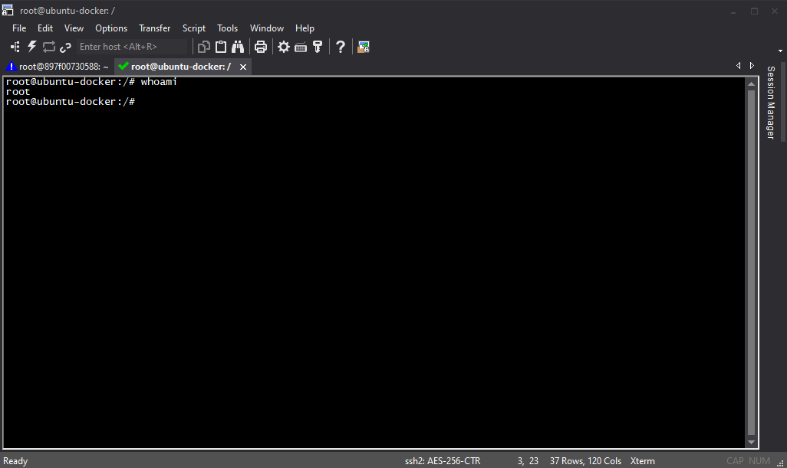
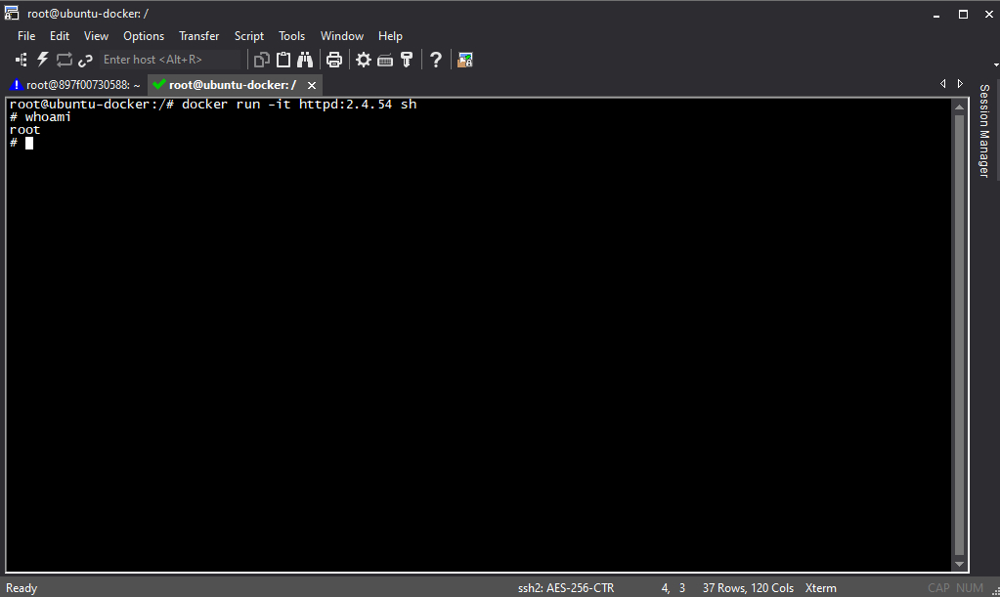
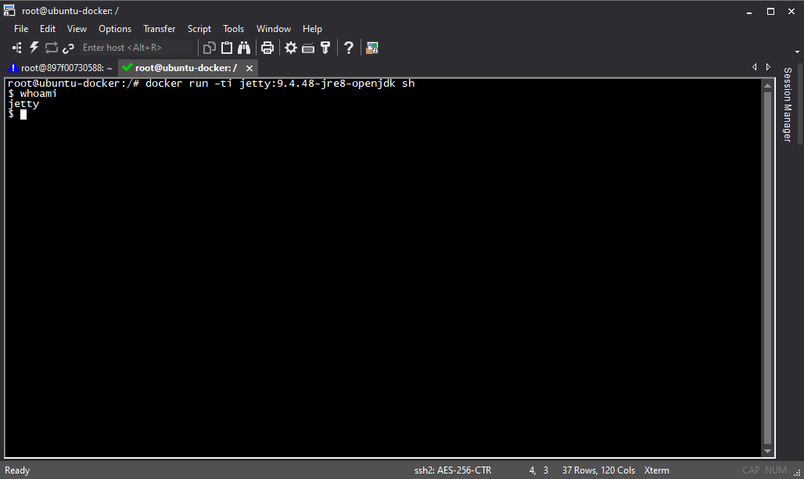
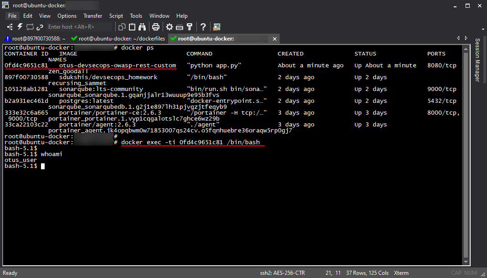
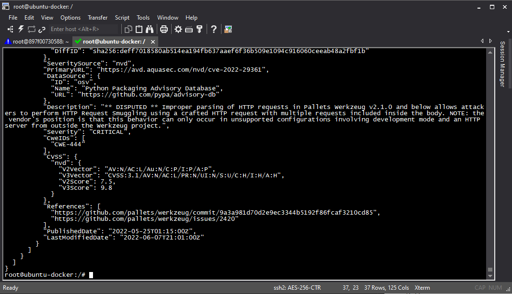

# Обеспечение безопасности в Docker контейнерах

```
Часть 1
1. Скачать любой docker-образ из репозитория docker.io
   (можно использовать любой из предыдущих домашних заданий)
2. С помощью команды docker image ls посмотреть, какие образы есть на вашей машине
3. До запуска контейнера выполнить команду whoami
4. Запустить командную оболочку sh внутри выбранного контейнера с помощью команды
   docker run -it <имя_образа_из_пункта_2> sh
5. Внутри контейнера выполнить команду whoami и посмотреть пользователя.
   Сделать скриншот с пунктами 3-5, он и будет ответом на первую часть домашнего задания.

Часть 2
1. Напишите простейший dockerfile, который выполнит build контейнера на основе
   базового контейнера из части 1
   (например, FROM ket9/otus-devsecops-owasp-rest:latest EXPOSE 8080)
2. Дополните dockerfile необходимыми инструкциями, чтобы внутри контейнера приложение
   запускалось не от пользователя root
3. Зайдите внутрь контейнера и выполните whoami.
   Подумайте, какие еще настройки безопасности можно указать в самом dockerfile
   и с какими флагами запускать контейнер. Укажите это в комментарии внутри Dockerfile.

Ответом ко второй части задания будет написанный Dockerfile и скриншот из пункта 2.

Часть 3
1. Прогнать образ через один из сканеров безопасности: https://github.com/quay/clair https://github.com/aquasecurity/trivy
2. Проанализировать его вывод.
Ответ - ваши выводы про безопасность выбранного образа, а также скрин с выводом сканера.
```

---

## Часть 1

- Скачаю образ из репозитория docker.io (httpd:2.4.54)

```bash
> docker pull httpd:2.4.54

2.4.54: Pulling from library/httpd
Digest: sha256:75d370e19ec2a456b6c80110fe30694ffcd98fc85151a578e14334a51eb94578
Status: Image is up to date for httpd:2.4.54
docker.io/library/httpd:2.4.54
```

- Посмотрю скачанные образы при помощи команды

```bash
> docker image ls

REPOSITORY                          TAG               IMAGE ID       CREATED         SIZE
postgres                            <none>            1133a9cdc367   2 weeks ago     376MB
httpd                               2.4.54            444f7df01ce9   2 weeks ago     145MB
sonarqube                           <none>            5f1ab3a835dc   5 weeks ago     499MB
sonarqube                           latest            75c013514322   6 weeks ago     534MB
mysql                               5.7               a3d35804fa37   2 months ago    462MB
mongo                               5.0.5             ee13a1eacac9   6 months ago    696MB
mongo                               latest            ee13a1eacac9   6 months ago    696MB
sonarqube                           9.2.0-community   60e2c441f386   8 months ago    549MB
sdukshis/devsecops_homework         latest            4642923a23e4   8 months ago    1.55GB
ket9/otus-devsecops-owasp-rest      latest            080abc666726   9 months ago    312MB
portainer/portainer-ce              <none>            5121527e11b8   11 months ago   206MB
portainer/agent                     <none>            9ffa457cae24   11 months ago   158MB
sonarqube                           <none>            81fe5f0a1278   15 months ago   499MB
newtmitch/sonar-scanner             latest            e9e2848e52b1   20 months ago   515MB
gb001.azurecr.io/samples/nginx      latest            aae476eee77d   3 years ago     17.7MB
mcr.microsoft.com/oss/nginx/nginx   1.15.5-alpine     aae476eee77d   3 years ago     17.7MB
ket9/otus-devsecops                 latest            5585d312a54b   6 years ago     472MB
```

- До запуска контейнера выполню команду whoami

```bash
> whoami

root
```



- Запущу командную оболочку sh внутри контейнера и выполню команду whoami

```bash
> docker run -it httpd:2.4.54 sh
> whoami

root
```



- Повторю команды whoami в другом контейнере

```bash
> docker pull jetty:9.4.48-jre8-openjdk
> docker run -ti jetty:9.4.48-jre8-openjdk sh
> whoami

jetty
```



---

## Часть 2

- Создам простейший Dockerfile для сборки образа ket9/otus-devsecops-owasp-rest:latest

```dockerfile
FROM ket9/otus-devsecops-owasp-rest:latest

EXPOSE 8080
```

- Дополню Dockerfile инструцкиями для того чтобы приложение запускалось не от пользователя root

```dockerfile
FROM ket9/otus-devsecops-owasp-rest:latest

RUN addgroup -S otus_group \
    && adduser -S otus_user -G otus_group \
    && rm -rf /var/cache/apk/*

RUN chown -R otus_user:otus_group /vampi

USER otus_user

EXPOSE 8080
```

Т.к. запустить командную оболочку командой запуска образа не удасться,
подключусь к уже запущенному контейнеру и там выполню команду whoami

- Собиру контейнер из ранее подготовленного Dockerfile

```
> docker build -t otus-devsecops-owasp-rest-custom .
```

- Запущу команду whoami внутри контейнера

```bash
> docker run -d otus-devsecops-owasp-rest-custom
> docker exec -ti 0fd4c9651c81 /bin/bash
> whoami

otus_user
```




### Возможные/дополнительные настройки безопасности контейнера (в dockerfile)

- указывать конкретный тэг образа (не стоит всегда использовать "latest") (FROM),
- *использовать подписанные образы (export DOCKER_CONTENT_TRUST=1),
- указывать метки (метаданные) (LABEL),
- использовать отдельного не привелегированного пользователя для выполнения задачи внутри контейнера (USER),
- минимизировать количество слоев в будущем образе,
- использовать легковесные образы,
- необходимо указывать тэги, собирая образы (командой build),
- использовать внутренний сканер уязвимостей (docker scan / snyk / clair / trivy)
- не хранить сенсетивную информацию внутри образов
- использовать инструкцию COPY вместо ADD

### Флаги запуска контейнеров
[> Runtime options with Memory, CPUs, and GPUs](https://docs.docker.com/config/containers/resource_constraints/)

```bash
# запуск контейнера в режиме чтения
docker run --read-only -d otus-devsecops-owasp-rest-custom

# запуск контейнера с подключенным volume в режиме чтения
docker run -v my_best_volume:/app/items:ro otus-devsecops-owasp-rest-custom

# ограничение межконтейнерного взаимодействия
--icc=false

# флаги ограничения ресурсов контейнера
# по памяти
--memory, --memory-swap

# по ядрам (процессору)
--cpus, --cpuset-cpus
```

---

## Часть 3

Выполню проверку образа <b>otus-devsecops-owasp-rest-custom</b> сканером <b>trivy</b>

- Выполню установку пакета [trivy](https://aquasecurity.github.io/trivy/v0.30.4/getting-started/installation/)

```bash
sudo apt-get install wget apt-transport-https gnupg lsb-release
wget -qO - https://aquasecurity.github.io/trivy-repo/deb/public.key | sudo apt-key add -
echo deb https://aquasecurity.github.io/trivy-repo/deb $(lsb_release -sc) main | sudo tee -a /etc/apt/sources.list.d/trivy.list
sudo apt-get update
sudo apt-get install trivy
```


- Выполню команду проверки образа

```bash
> trivy --format json --output tviny-result.json image otus-devsecops-owasp-rest-custom
> trivy --output trivy-result.txt image otus-devsecops-owasp-rest-custom
```

```
otus-devsecops-owasp-rest-custom (alpine 3.14.2)
================================================
Total: 54 (UNKNOWN: 0, LOW: 0, MEDIUM: 10, HIGH: 34, CRITICAL: 10)

Python (python-pkg)
===================
Total: 2 (UNKNOWN: 0, LOW: 0, MEDIUM: 0, HIGH: 1, CRITICAL: 1)
```

Отчет целиком:
[> json](./reports/tviny-result.json)
[> table](./reports/trivy-result.txt)



Вывод:
В этом образе достаточно монго уязвимостей в установленных пакетах, поэтому важно устанавливать только необходимые
