# Обеспечение безопасности в Kubernetes

---

## Подготовительный этап

### > Создам кластер Kubernetes на VK Cloud Solution

|Параметр|Значение|
|-|-|
|Версия Kubernetes|1.22.9|
|<b>Мастер</b>|-|
|VM name|kubernetes-cluster-4303|
|CPU|2|
|RAM|4 Gb|
|Сеть (для узлов)|10.0.0.0/24|
|Сеть (для подов)|10.100.0.0/16|
|<b>Группа узлов</b>|-|
|VM name|default-group|
|CPU|1|
|RAM|2 Gb|


- Установлю <b>kubectl</b>
- Экспортирую конфигурационный файл созданного кластера с расширением *.yml и укажу путь до этого файла в переменной окружения "<b>KUBECONFIG</b>"

### > Проверю подключение к кластеру при помощи команды

```bash
> kubectl get nodes 

NAME                                      STATUS   ROLES    AGE    VERSION
kubernetes-cluster-4303-default-group-0   Ready    <none>   108m   v1.22.9
kubernetes-cluster-4303-master-0          Ready    master   109m   v1.22.9
```

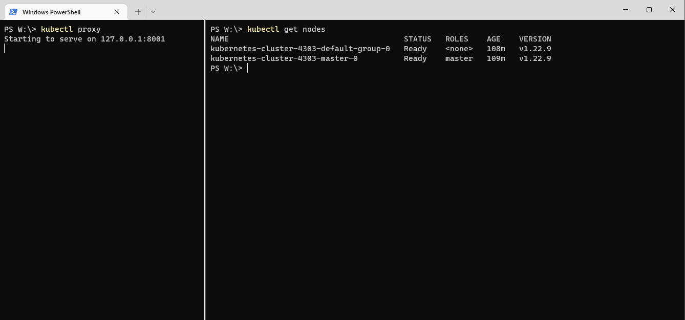

### > Запущу поды

- <i>[kuber_devsecops.yaml](./resources/kuber_devsecops.yaml)</i>

```bash
> kubectl apply -f .\kuber_devsecops.yaml

deployment.apps/devsecops-db created
service/devsecops-db created
deployment.apps/devsecops-front created
service/devsecops-front created
```

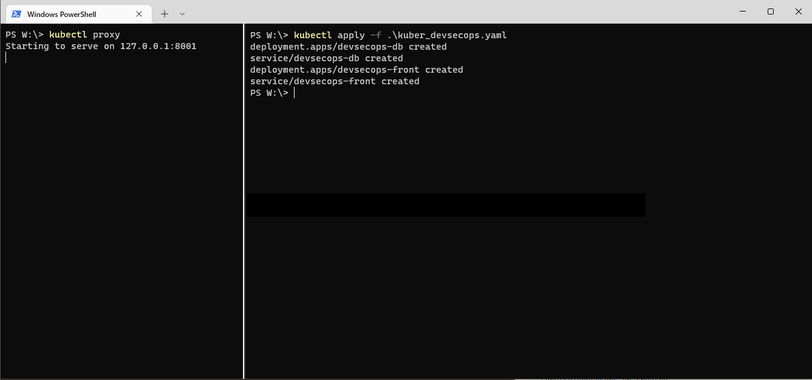

### > Посмотрю запущенные поды

```bash
> kubectl get pods

NAME                               READY   STATUS    RESTARTS   AGE
devsecops-db-55d9964b79-ggrsk      1/1     Running   0          3m28s
devsecops-front-5dc7d56f57-5hw9d   1/1     Running   0          3m28s
```

### > Посмотрю IP-адреса запущенных сервисов

```bash
> kubectl get svc

NAME              TYPE           CLUSTER-IP       EXTERNAL-IP      PORT(S)        AGE
devsecops-db      ClusterIP      10.254.70.12     <none>           3306/TCP       5m3s
devsecops-front   LoadBalancer   10.254.250.210   213.219.215.64   80:31546/TCP   5m3s
kubernetes        ClusterIP      10.254.0.1       <none>           443/TCP        134m
```

### > Проверю доступность приложения 'devsecops-front' по внешнему IP

```bash
> tnc 213.219.215.64 -p 80

ComputerName: 213.219.215.64
RemoteAddress: 213.219.215.64
RemotePort: 80
InterfaceAlias: Ethernet
SourceAddress: ---
TcpTestSucceeded : True

---

> C:\Curl\curl-7.84.0_6-win64-mingw\bin\curl.exe 213.219.215.64

<?xml version="1.0" encoding="UTF-8"?>
<html>
   <head><title>SQLi otus lab</title></head>
   <body>
      <a href="sql-connections/setup-db.php"><font color="#A00000">Установить/сбросить базу</font></a></br></br>
      <a href="task"><font color="#000080">Начать!</font></a><br><br>
   </body>
</html>
```

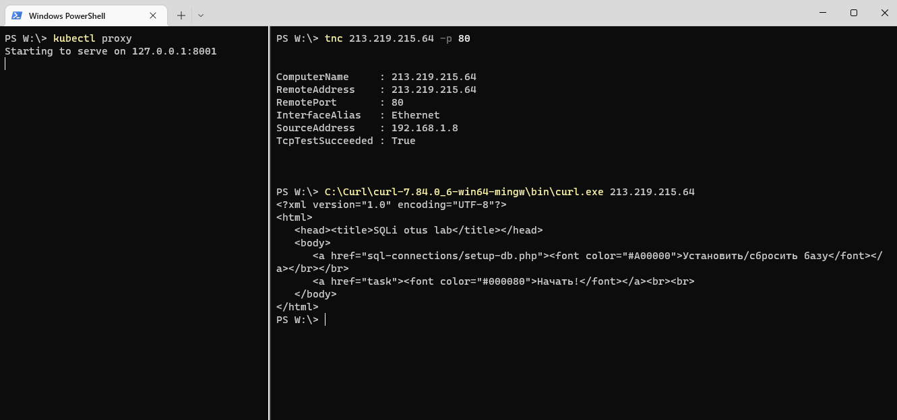

### > Выполню проверку кластера из консоли

```bash
> kubectl get all

NAME                                   READY   STATUS    RESTARTS   AGE
pod/devsecops-db-55d9964b79-ggrsk      1/1     Running   0          15h
pod/devsecops-front-5dc7d56f57-5hw9d   1/1     Running   0          15h

NAME                      TYPE           CLUSTER-IP       EXTERNAL-IP      PORT(S)        AGE
service/devsecops-db      ClusterIP      10.254.70.12     <none>           3306/TCP       15h
service/devsecops-front   LoadBalancer   10.254.250.210   213.219.215.64   80:31546/TCP   15h
service/kubernetes        ClusterIP      10.254.0.1       <none>           443/TCP        18h

NAME                              READY   UP-TO-DATE   AVAILABLE   AGE
deployment.apps/devsecops-db      1/1     1            1           15h
deployment.apps/devsecops-front   1/1     1            1           15h

NAME                                         DESIRED   CURRENT   READY   AGE
replicaset.apps/devsecops-db-55d9964b79      1         1         1       15h
replicaset.apps/devsecops-front-5dc7d56f57   1         1         1       15h
```

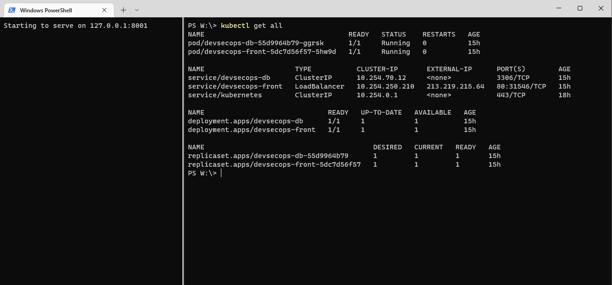

### > Посмотрю подробную информацию по объекту (сервису) 'devsecops-front'

```bash

> kubectl describe service devsecops-front

Name:                     devsecops-front
Namespace:                default
Labels:                   <none>
Annotations:              <none>
Selector:                 app=devsecops-front
Type:                     LoadBalancer
IP Family Policy:         SingleStack
IP Families:              IPv4
IP:                       10.254.250.210
IPs:                      10.254.250.210
LoadBalancer Ingress:     213.219.215.64
Port:                     <unset>  80/TCP
TargetPort:               80/TCP
NodePort:                 <unset>  31546/TCP
Endpoints:                10.100.235.131:80
Session Affinity:         None
External Traffic Policy:  Cluster
Events:                   <none>
```

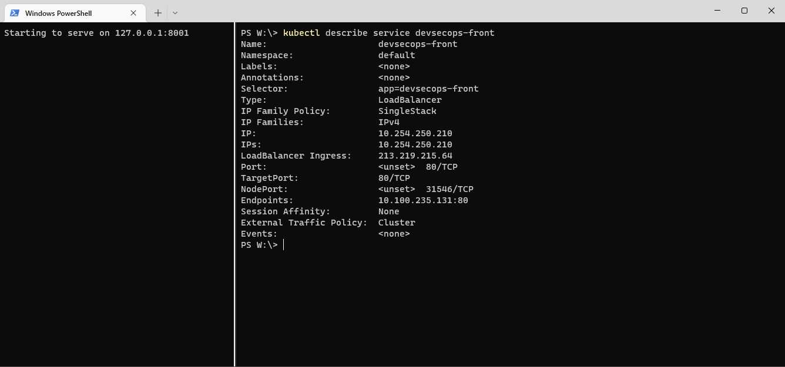

---

## Мониторинг

### > Мониторинг предлагается отдельной опцией (Prometheus + Grafana)

По-умолчанию стандартный агент собирает метрики:
- Потребление CPU
- Потребление памяти
- Статистику страниц ядра ОС
- Информацию о диске
- Информацию о дисковом IO
- Информацию о работе сетевой подсистемы внутри ОС
- Информацию из NetStat

[Полный перечень собираемых метрик](https://mcs.mail.ru/docs/manage/monitoring/monitoring-dash/mon-metrics)

Помимо мониторинга, доступен [Kubernetes Dashboard](http://127.0.0.1:8001/api/v1/namespaces/kube-system/services/https:kubernetes-dashboard:/proxy/)

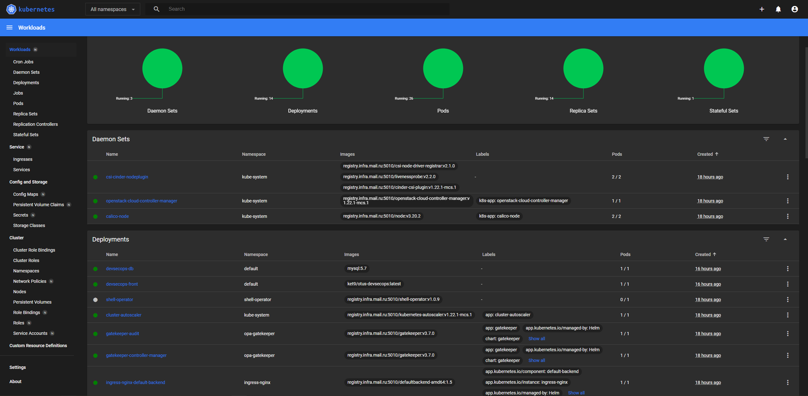

---

## RBAC

### > Создам два неймспейса:

```bash
> kubectl create ns read-access

namespace/read-access created
```

```bash
> kubectl create ns delete-access

namespace/delete-access created
```

```bash
> kubectl get ns

NAME               STATUS   AGE
default            Active   18h
delete-access      Active   4m37s
helm-deployments   Active   18h
ingress-nginx      Active   18h
kube-node-lease    Active   18h
kube-public        Active   18h
kube-system        Active   18h
opa-gatekeeper     Active   18h
read-access        Active   7m56s
shell-operator     Active   18h
```

### > В каждом созданном неймспейсе пропишем наше приложение

```bash
> kubectl create -f .\kuber_devsecops.yaml -n read-access

deployment.apps/devsecops-db created
service/devsecops-db created
deployment.apps/devsecops-front created
service/devsecops-front created
```

```bash
> kubectl create -f .\kuber_devsecops.yaml -n delete-access

deployment.apps/devsecops-db created
service/devsecops-db created
deployment.apps/devsecops-front created
service/devsecops-front created
```

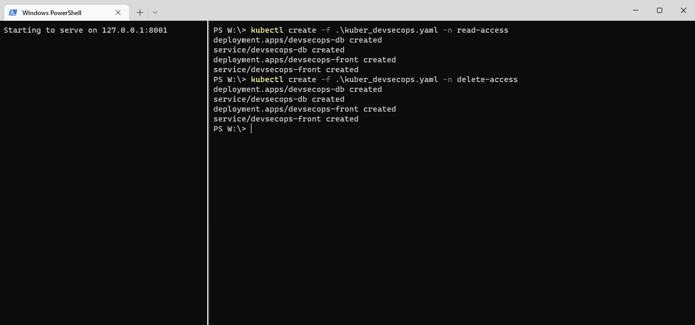

### > *Создам группу пользователей

Создадим группу пользователей. Это можно сделать либо через интерфейс сайта, либо из консоли командой:

```bash
az ad group create - - display-name devsec --mail-nickname devsec --query objectId -o tsv
```

<i>пропустил шаг создания группы.</i><br/><b>(нужна подсказка, как это сделать в VK Cloud Solution)</b>

### > Создам объекты

- <i>[clusterRole.yaml](./resources/clusterRole.yaml)</i>
- <i>[clusterRoleBinding.yaml](./resources/clusterRoleBinding.yaml)</i>
- <i>[roleBinding.yaml](./resources/roleBinding.yaml)</i>

```bash

> kubectl create -f .\clusterRole.yaml
clusterrole.rbac.authorization.k8s.io/readOnly created

> kubectl create -f .\clusterRoleBinding.yaml
clusterrolebinding.rbac.authorization.k8s.io/readOnlyBinding created

> kubectl create -f .\roleBinding.yaml
rolebinding.rbac.authorization.k8s.io/deleteBinding created
```

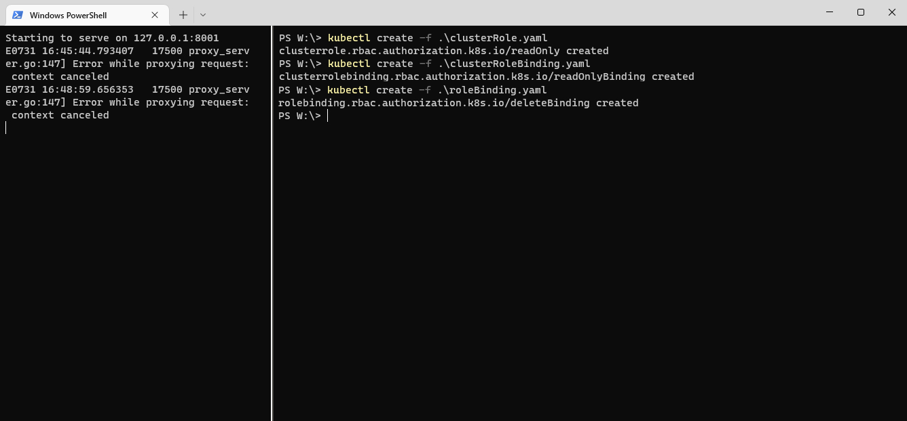

### > Посмотрю список подов

```bash
> kubectl get pods -n read-access

NAME                               READY   STATUS    RESTARTS   AGE
devsecops-db-55d9964b79-vxn8x      1/1     Running   0          107m
devsecops-front-5dc7d56f57-tk92w   1/1     Running   0          107m

> kubectl get pods -n delete-access
NAME                               READY   STATUS    RESTARTS   AGE
devsecops-db-55d9964b79-nswbz      1/1     Running   0          107m
devsecops-front-5dc7d56f57-t6wm2   1/1     Running   0          107m
```

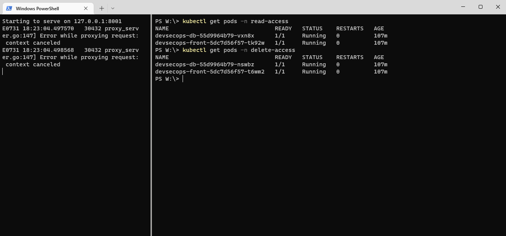

### > Удаление подов из неймспейсов

```bash
> kubectl delete pod --all -n read-access

pod "devsecops-db-55d9964b79-vxn8x" deleted
pod "devsecops-front-5dc7d56f57-tk92w" deleted
```

```bash
> kubectl delete pod --all -n delete-access
pod "devsecops-db-55d9964b79-nswbz" deleted
pod "devsecops-front-5dc7d56f57-t6wm2" deleted
```

Ноды были успешно удалены из неймспейсов (read-access, delete-access)
> Возможно предполагалось, что нельзя будет удалить поды из неймспейса <b>read-access</b>, т.к. текущему пользователю необходимо находиться в группе <b>devsec</b>

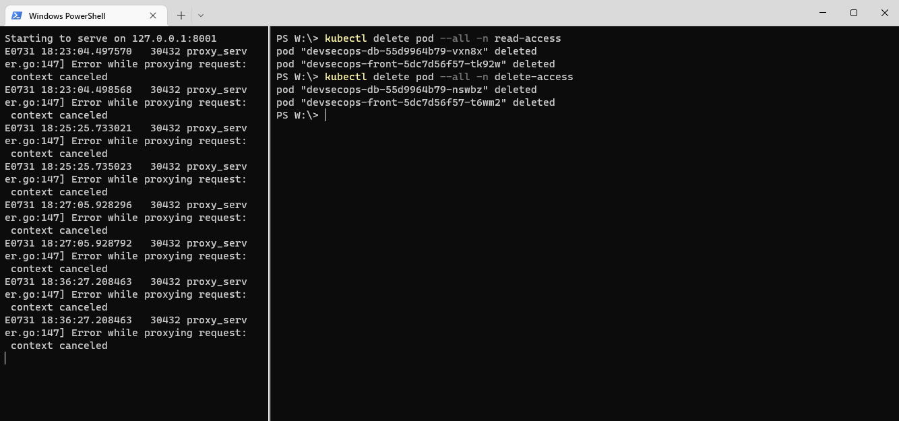

---

## Создание секрета в Kubernetes

### > Создание секрета из yaml-файла

Закодирую секрет из String в Base64

```bash
> echo ‘https://very-secret-api.mydomain.com‘ | base64
4oCYaHR0cHM6Ly92ZXJ5LXNlY3JldC1hcGkubXlkb21haW4uY29t4oCYCg==

echo 'DevSecOps Secret' | base64
RGV2U2VjT3BzIFNlY3JldAo=
```

Загружу секрет из файла [secret.yaml](./resources/secret.yaml) в Kubernetes

```bash
> kubectl create -f .\secret.yaml

error: error validating ".\\secret.yaml": error validating data: ValidationError(Secret): 
unknown field "matedata" in io.k8s.api.core.v1.Secret;
if you choose to ignore these errors, turn validation off with --validate=false
```

В файле секрета присутствует ошибка
Неправильное наименование блока <b>matedata</b>, исправлю его на <b>matadata</b>

```yaml
apiVersion: v1
kind: Secret
matadata:
  name: myapitoken
type: Opaque
data:
  url: 4oCYaHR0cHM6Ly92ZXJ5LXNlY3JldC1hcGkubXlkb21haW4uY29t4oCYCg==
  token: RGV2U2VjT3BzIFNlY3JldAo=
```

Загружу секрет из (исправленного) файла [secret.yaml](./resources/secret.yaml) в Kubernetes

```bash
> kubectl create -f .\secret.yaml

secret/myapitoken created
```

Проверю наличие секрета (<b>myapitoken</b>) в секретах Kubernetes

```bash
> kubectl get secrets

NAME                       TYPE                                  DATA   AGE
dashboard-sa-token-7mszb   kubernetes.io/service-account-token   3      21h
default-token-cwwbd        kubernetes.io/service-account-token   3      21h
myapitoken                 Opaque                                2      8m49s
regcred                    kubernetes.io/dockerconfigjson        1      21h
```

или

```bash
> kubectl get -o yaml secrets myapitoken

apiVersion: v1
data:
  token: RGV2U2VjT3BzIFNlY3JldAo=
  url: 4oCYaHR0cHM6Ly92ZXJ5LXNlY3JldC1hcGkubXlkb21haW4uY29t4oCYCg==
kind: Secret
metadata:
  creationTimestamp: "2022-07-31T16:37:27Z"
  name: myapitoken
  namespace: default
  resourceVersion: "201505"
  selfLink: /api/v1/namespaces/default/secrets/myapitoken
  uid: d86ba268-5fa8-4708-8df5-318cb08f994f
type: Opaque
```

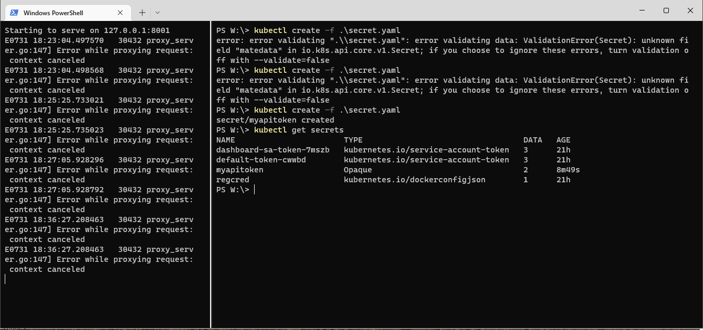

Секрет присутствует в списке

---

## Недостатки конфигурационного ([kuber_devsecops.yaml](./resources/kuber_devsecops.yaml)) файла или как сделать ещё лучше...

> <i>docker run -v /tmp/yamls:/app zegl/kube-score score /app/kuber_devsecops.yaml</i>

- (*) Настроить поды под запускаемые службы

- Настроить ImagePullPolicy

```yaml
apiVersion: v1
kind: Pod
metadata:
   name: devsecops-db
spec:
   containers:
   - name: mysql:5.7
     image: mysql:5.7
     imagePullPolicy: Always
     imagePullSecrets:
     - name: devsecops-db-secret
```

- Настроить NetworkPolicy
(указать разрешенные/запрещенные IP, порты, протоколы, тип политики)

```yaml
kind: NetworkPolicy
apiVersion: networking.k8s.io/v1
...
```

- Настроить Pod Probes

```yaml
apiVersion: v1
kind: Pod
metadata:
   name: devsecops-db
spec:
   containers:
   - name: mysql:5.7
     image: mysql:5.7
     env:
       - name: "MYSQL_USER"
         value: "mysql"
       - name: "MYSQL_PASSWORD"
         value: "mysql"
       - name: "MYSQL_DATABASE"
         value: "sample"
       - name: "MYSQL_ROOT_PASSWORD"
         value: "supersecret"
     ports:
       - containerPort: 3306
```

- Настроить контекст (Container Security Context User Group ID)

```yaml
   spec:
      securityContext:
        runAsUser: 10000
        runAsGroup: 10000
        fsGroup: 10000
```

- Настроить временные лимиты хранилища (Container Ephemeral Storage Request and Limit)

```yaml
apiVersion: v1
kind: ResourceQuota
metadata:
  name: compute-resources
spec:
  hard:
    pods: "4" 
    requests.cpu: "1" 
    requests.memory: 1Gi 
    requests.ephemeral-storage: 2Gi 
    limits.cpu: "2" 
    limits.memory: 2Gi 
    limits.ephemeral-storage: 4Gi
```

- Настроить контекст безопасности файловой системы (Container Security Context ReadOnlyRootFilesystem)
(в случаях, где такой контекст возможен)

```yaml
apiVersion: v1
kind: Pod
metadata:
  name: <Pod name>
spec:
  containers:
  - name: <container name>
    image: <image>
    securityContext:
+      readOnlyRootFilesystem: true
```

- Указывать конкретные версии образов, не использовать тэг <b>latest</b> (Container Image Tag)

```yaml
   devsecops-front
      image: ket9/otus-devsecops:latest
```

- Исключить из сборочного файла пароли в открытом виде, лучше использовать секреты из Kubernetes
- Необходимо проверять наличие уязвимостей в образах для будущих контейнеров
- (общее) Использовать Pod Security Admission (PSA)
- (общее) Использовать для каждого Pod'a свой контекст безопасности в котором он выполняется
- (общее) При работе с секретами нужно использовать "ротацию учетных данных" 