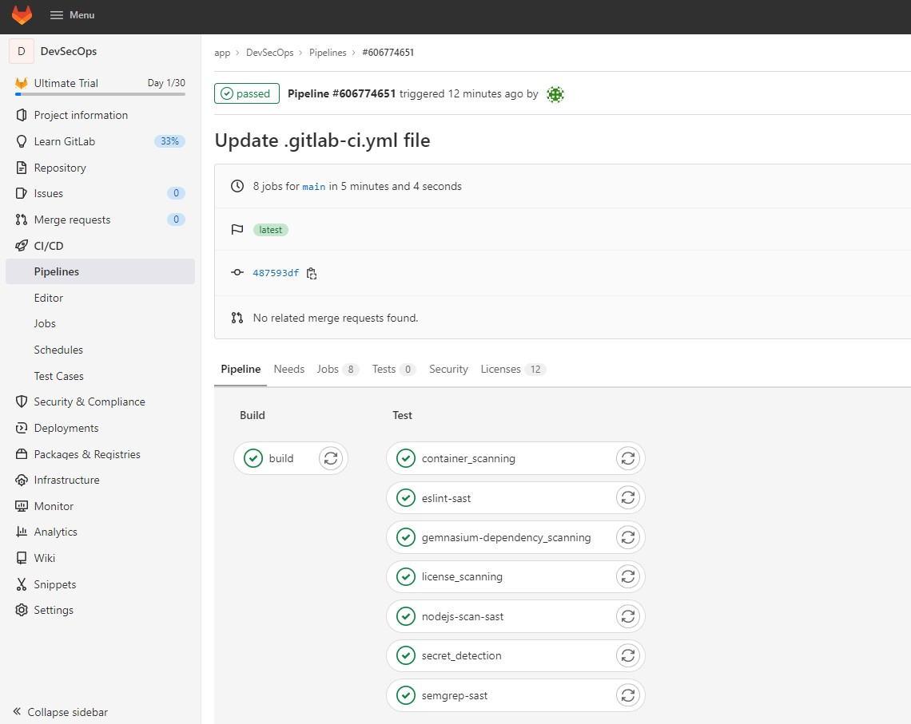
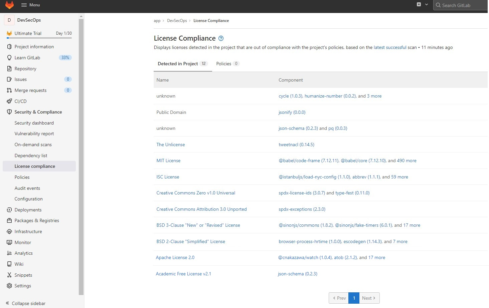
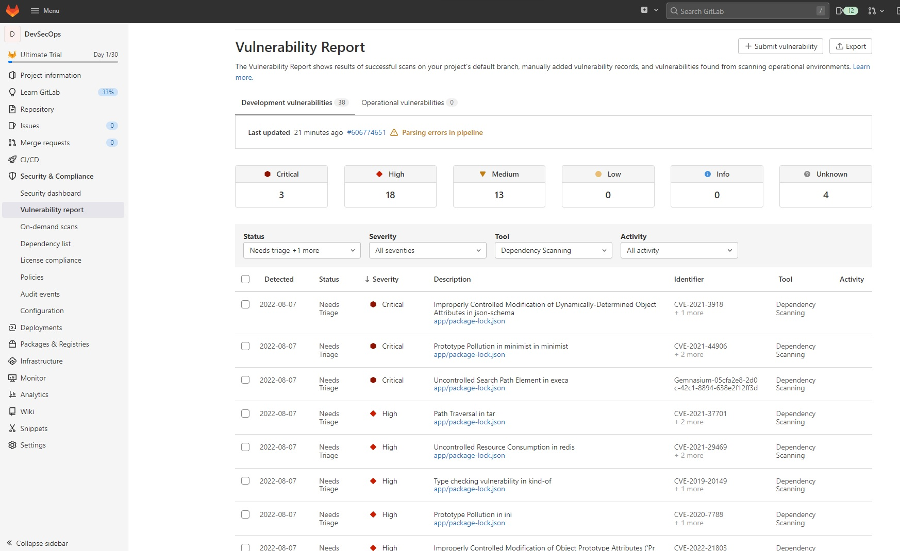
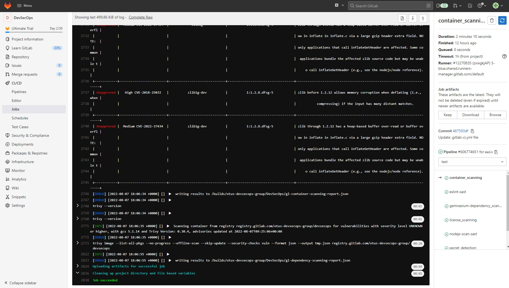
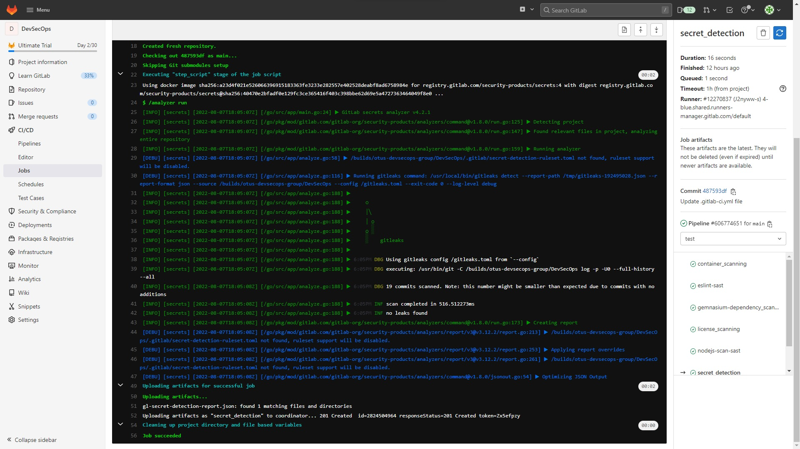

# Обзор DevSecOps инструментария

## Подготовительный этап

> Для выполнения практической работы потребуется активировать <b>GitLab Free Trial</b>

1. Создам группу с именем <b>app</b>

- Имя: app
- ID: \<Отличен от имени группы>

2. Активирую GitLab Free Trial и подключу его к группе <b>app</b>

3. Создам проект <b>DevSecOps</b> в группе <b>app</b> через импортирование репозитория [DevSecOps (Otus)](https://github.com/DevSecOps-OTUS/DevSecOps.git)

## Внедрение в пайплайн сборки проекта на NodeJS проверок безопасности

Исходный файл сборки проекта <b>.gitlab-ci.yml</b>

```yaml
# You can override the included template(s) by including variable overrides
# SAST customization: https://docs.gitlab.com/ee/user/application_security/sast/#customizing-the-sast-settings
# Secret Detection customization: https://docs.gitlab.com/ee/user/application_security/secret_detection/#customizing-settings
# Dependency Scanning customization: https://docs.gitlab.com/ee/user/application_security/dependency_scanning/#customizing-the-dependency-scanning-settings
# Note that environment variables can be set in several places
# See https://docs.gitlab.com/ee/ci/variables/#cicd-variable-precedence
build:
  stage: build
  image: docker:latest
  stage: build
  services:
    - docker:dind
  before_script:
    - docker login -u "$CI_REGISTRY_USER" -p "$CI_REGISTRY_PASSWORD" $CI_REGISTRY
  script:
    - docker build --pull -t "$CI_REGISTRY_IMAGE" ./app
    - docker push "$CI_REGISTRY_IMAGE"
  only:
    - master
variables:
  LICENSE_FINDER_CLI_OPTS: '--recursive'
  DOCKER_IMAGE: "$CI_REGISTRY_IMAGE"
  SECURE_LOG_LEVEL: 'debug'

```

Добавлю в него "шаблоны" проверок

```yaml
include:
  - template: Security/Dependency-Scanning.gitlab-ci.yml
  - template: Security/Container-Scanning.gitlab-ci.yml
  - template: Security/License-Scanning.gitlab-ci.yml
  - template: Security/SAST.gitlab-ci.yml
  - template: Security/Secret-Detection.gitlab-ci.yml
```

Чтобы убрать ошибку, возникающую на этапе Secret Scanning, добавлю переменную "SECRET_DETECTION_HISTORIC_SCAN" со значением <b>\<true></b>
(включаем историческое сканирование)

```yaml
variables:
  SECRET_DETECTION_HISTORIC_SCAN: "true"
```

Результирующий файл сборки проекта <b>.gitlab-ci.yml</b>

```yaml
# You can override the included template(s) by including variable overrides
# SAST customization: https://docs.gitlab.com/ee/user/application_security/sast/#customizing-the-sast-settings
# Secret Detection customization: https://docs.gitlab.com/ee/user/application_security/secret_detection/#customizing-settings
# Dependency Scanning customization: https://docs.gitlab.com/ee/user/application_security/dependency_scanning/#customizing-the-dependency-scanning-settings
# Note that environment variables can be set in several places
# See https://docs.gitlab.com/ee/ci/variables/#cicd-variable-precedence
include:
  - template: Security/Dependency-Scanning.gitlab-ci.yml
  - template: Security/Container-Scanning.gitlab-ci.yml
  - template: Security/License-Scanning.gitlab-ci.yml
  - template: Security/SAST.gitlab-ci.yml
  - template: Security/Secret-Detection.gitlab-ci.yml

build:
  image: docker:latest
  stage: build
  services:
    - docker:dind
  before_script:
    - docker login -u "$CI_REGISTRY_USER" -p "$CI_REGISTRY_PASSWORD" $CI_REGISTRY
  script:
    - docker build --pull -t "$CI_REGISTRY_IMAGE" ./app
    - docker push "$CI_REGISTRY_IMAGE"
  only:
    - main
variables:
  LICENSE_FINDER_CLI_OPTS: '--recursive'
  DOCKER_IMAGE: "$CI_REGISTRY_IMAGE"
  SECURE_LOG_LEVEL: 'debug'
  SECRET_DETECTION_HISTORIC_SCAN: "true"
```

Запущу пайплайн и посмотрю результат исполнения:
<br/>Все этапы пройдены успешно:
- Container Scanning
- License Scanning
- Secret Detection
- Dependency Scanning



---

Перечень найденных лицензий в проекте:



---

Найденные уязвимости Dependency Scanning:



---

Найденные уязвимости Container Scanning:

Отчеты: [gl-container-scanning-report.json](./reports/gl-container-scanning-report.json), [gl-dependency-scanning-report.json](./reports/gl-dependency-scanning-report.json)



---

Безошибочно выполненный этап Secret Scanning:

