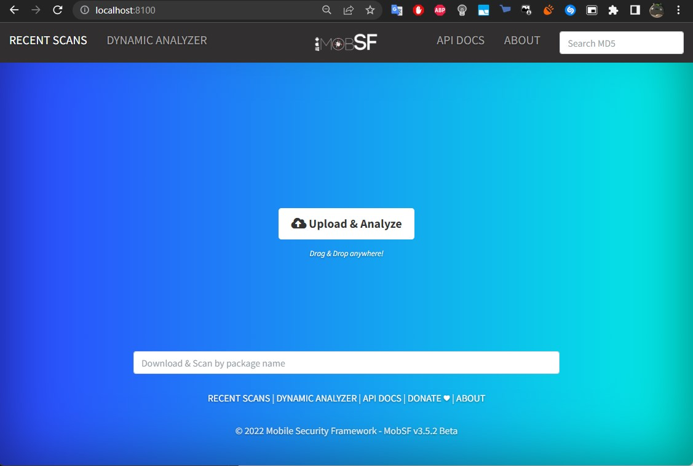
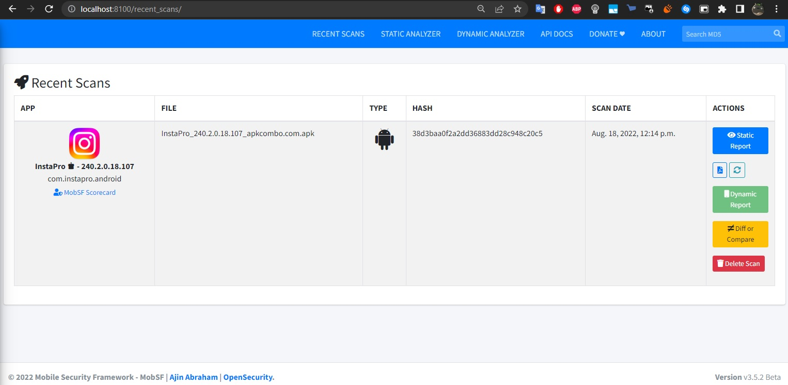
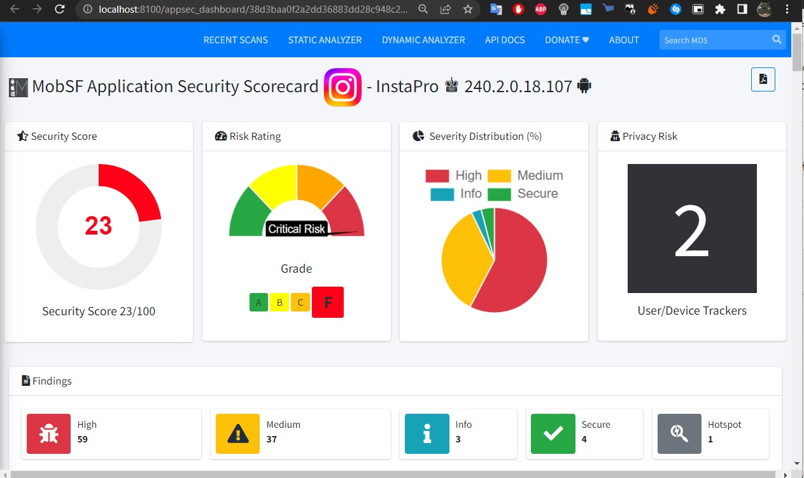
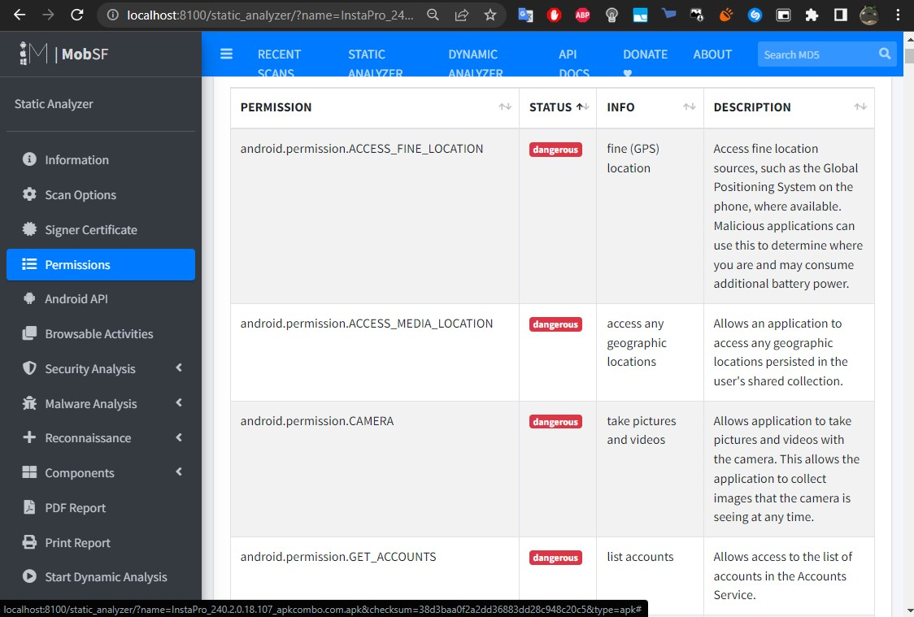
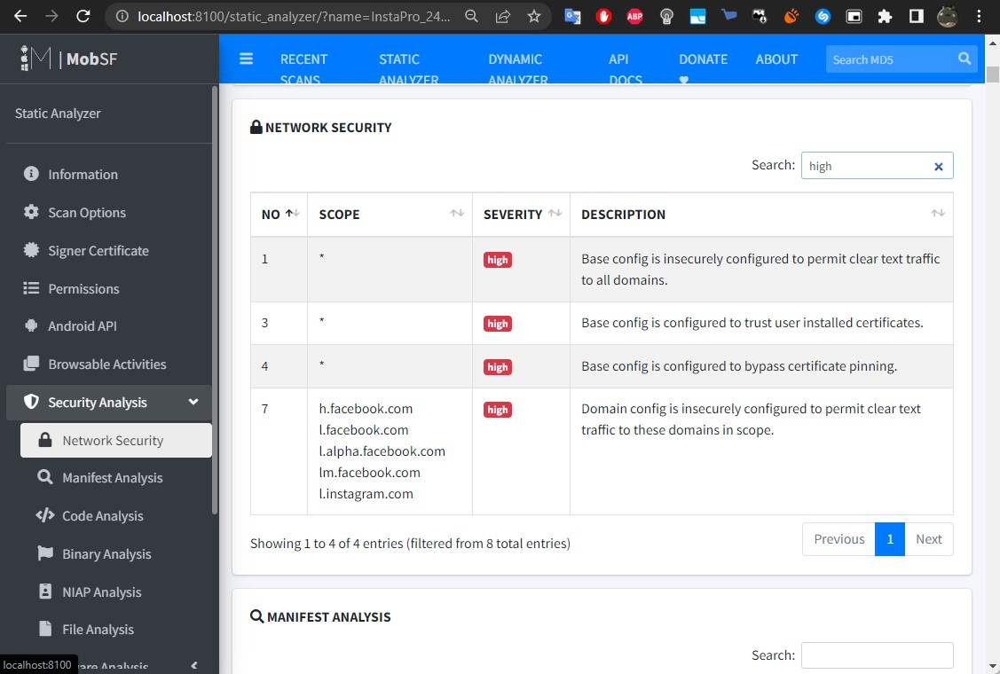
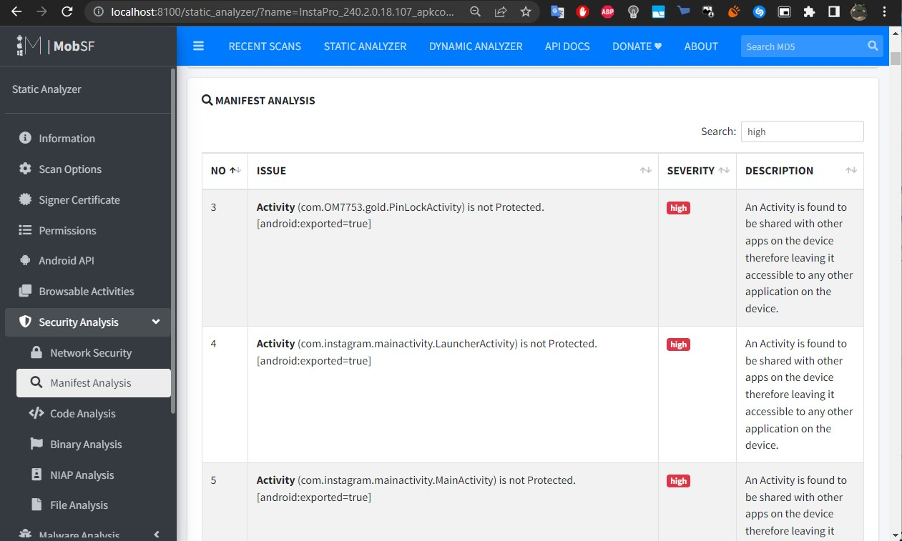
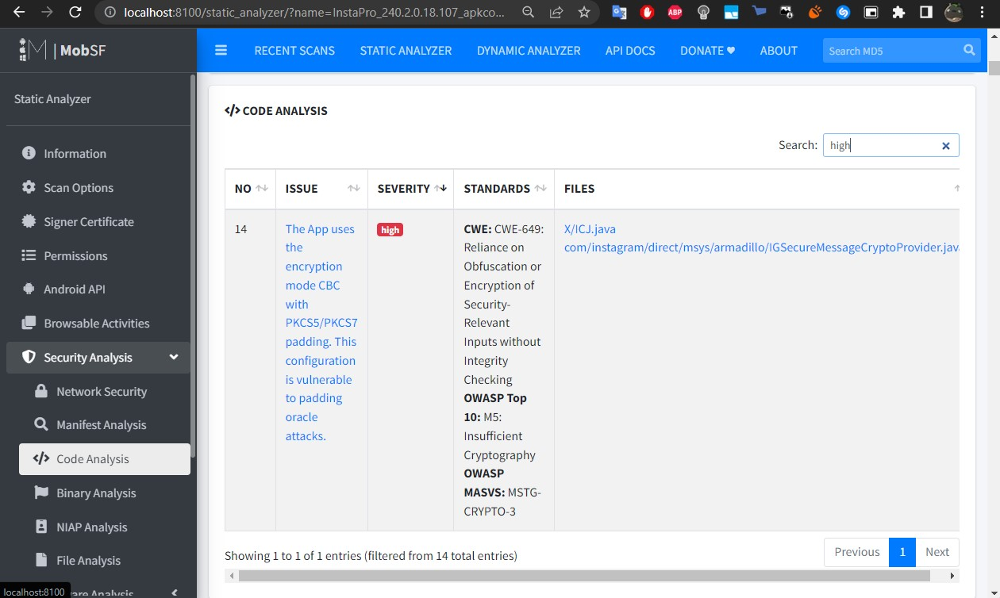

# Анализ исходного кода на безопасность (SAST/DAST/IAST)

## Подготовительный этап

Ввиду отсутствия возможности использовать K8S, буду пользоваться Docker Desktop.

### Произведу установку инструмента SAST-анализа мобильных приложений (MobSF)

Скачаю образ MobSF с DockerHub

```
docker pull opensecurity/mobile-security-framework-mobsf
```

Запущу контейнер

```
docker run -d --rm -p 8100:8000 opensecurity/mobile-security-framework-mobsf:latest
```

### Загружу мобильное приложение

Для этого использую сайт https://apkcombo.com/ru
```
Тестируемое приложение: InstaPro 240.2.0.18.107 
```

---

## Проведу SAST тестирование для мобильного приложения

Для этого перенесу скачанный пакет приложения в web-gui MobSF по адресу http://localhost:8100/



Перенесу проверяемое приложение (InstaPro 240.2.0.18.107) на текущую страницу.
<br/>Дождусь окончания проверки





Выделю основные проблемы:
- <b>App Permissions</b> со статусом <span style="background:red;color:white; padding:3px; border-radius:5px">dangerous</span>
- <b>Network Security</b> с severity уровня <span style="background:red;color:white; padding:3px; border-radius:5px">high</span> и выше
- <b>Manifest Analysis</b> с severity уровня <span style="background:red;color:white; padding:3px; border-radius:5px">high</span> и выше
- <b>Code Analysis</b> с severity уровня <span style="background:red;color:white; padding:3px; border-radius:5px">high</span> и выше

---

## Отчет проверки

[Скачать отчет (pdf)](./report/MobFS_report.pdf)

---

### App Permissions



---

### Network Security



---

### Manifest Analysis



---

### Code Analysis



---

### План по митигации обнаруженных рисков

#### Application Permissions:
|Permission|Mitigation of identified risks|
|-|-|
|android.permission.WRITE_EXTERNAL_STORAGE|Разрешить доступ записи/чтения только для конкрутных каталогов, а не для всего устройства целиком|
|android.permission.RECORD_AUDIO|Запись аудио должна осуществляться только по запросу пользователя, но никак не в скрытом режиме|
|android.permission.READ_PHONE_STATE|Досуп к состоянию телефона нужен (возможно) для определения состояния "С сети/Не в сети"|
|android.permission.READ_CONTACTS|Чтение контактов (на мой взгляд) избыточно, т.к. в подписках у меня могут присутствовать пользователи не из контактов|
|android.permission.ACCESS_MEDIA_LOCATION||
|android.permission.ACCESS_FINE_LOCATION|Предоставлять доступ к геолокации (GPS) только для отдельных функций, где это требуется|

#### Network Security:
|Description|Mitigation of identified risks|
|-|-|
|Base config is insecurely configured to permit clear text traffic to all domains|Нужно запретить передачу трафика по не зашифрованным каналам|
|Base config is configured to trust user installed certificates|Запретить доверять самоподписанных сертификатов и сертификатов добавленных пользователем|
|Base config is configured to bypass certificate pinning|Запретить обход закрепленных сертификатов|
|Domain config is insecurely configured to permit clear text traffic to these domains in scope|Использовать HTTPS вместо HTTP<br/>Использовать usesCleartextTraffic=”true” в AndroidManifest.xml<br/>Создать res/xml/network_security_config.xml и модифицировать AndroidManifest.xml|

#### Manifest Analysis:
|Description|Mitigation of identified risks|
|-|-|
|An Activity is found to be shared with other apps on the device therefore leaving it accessible to any other application on the device|Необходимо закрыть внешний доступ к активностям, которые не должны быть видны другим приложениям|
|An Activity-Alias is found to be shared with other apps on the device therefore leaving it accessible to any other application on the device|Аналогично поступить и с алиасми активонстей, закрыть внешний доступ тем, что потенциально не должны быть видны другим приложениям|
|A Content Provider is found to be shared with other apps on the device therefore leaving it accessible to any other application on the device|Аналогично, закрыть доступ к контексту провадеров, что не будет использован другими приложениями|
|A Broadcast Receiver is found to be shared with other apps on the device therefore leaving it accessible to any other application on the device.|Аналогично действиям, описанным выше|

#### Code Analysis:
|Issue|Standarts|File|Mitigation of identified risks|
|-|-|-|-|
|The App uses the encryption mode CBC with PKCS5/PKCS7 padding. This configuration is vulnerable to padding oracle attacks.|CWE: CWE-649:<br/>Reliance on Obfuscation or Encryption of  Security-Relevant Inputs without Integrity<br/>Checking:<br/>- OWASP Top 10:<br/><b>"M5: Insufficient Cryptography"</b><br/>- OWASP MASVS:<br/><b>MSTG-CRYPTO-3</b>|com/<br/>instagram/<br/>direct/<br/>msys/<br/>armadillo/<br/>IGSecureMessageCryptoProvider.java|Обеспечить проверку целостности шифрованных данных|